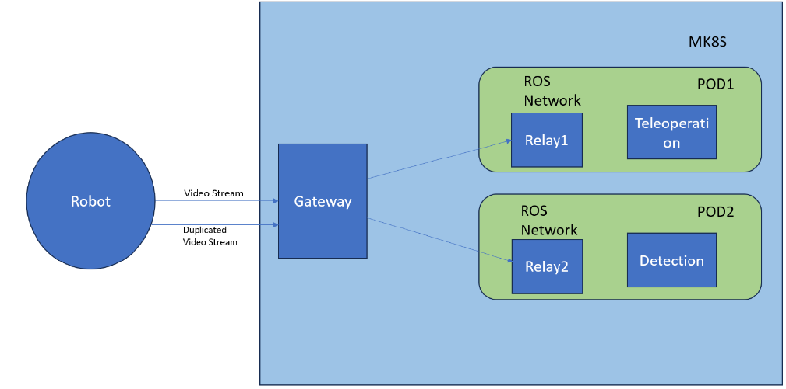
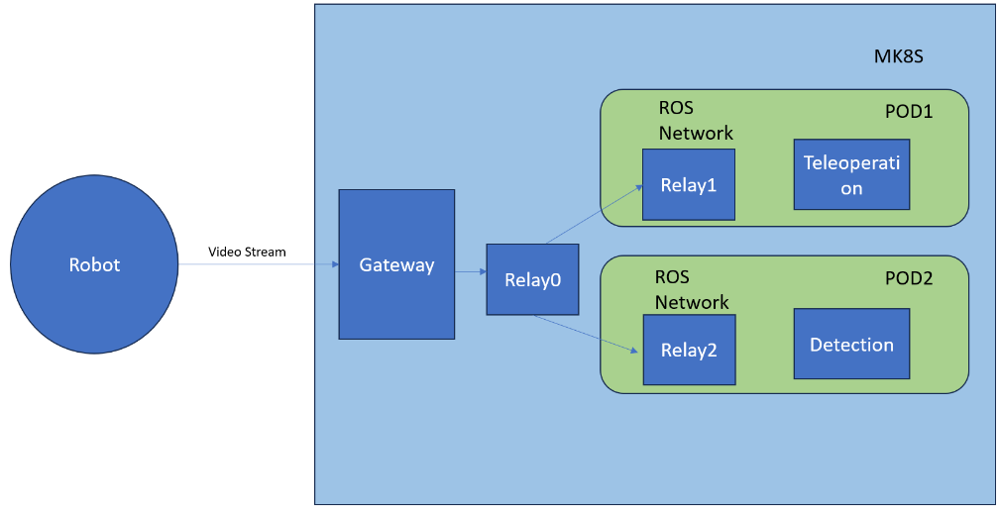

# Relay Network Application

This is ROS2 version

Some useful example commands are [here](commands.md)

This repository contains the Relay Network Application, which enables the seamless transition of
ROS-based application from local deployments to remote deployments on cloud- or edge-devices.
It uses methods of Rosbridge-suite for translation of ROS messages to JSON and vice versa.
The Socket.IO library is used for transport of the data between robot and edge/cloud. It allows
to mirror topics from robot to edge/server and vice versa. Moreover, it supports service calls
from robot to edge/cloud.

## Description

The Relay Network Application consists of three parts: Relay Client, Relay Server and Relay Inter.

### Relay Client

The Relay Client runs on robot and initiates the connection to the Relay Server. For configuration,
there are the following environment variables, `TOPICS_TO_SERVER`, `TOPICS_FROM_SERVER`, `SERVICES_TO_SERVER`, `ACTIONS_TO_SERVER` and `TRANSFORMS_TO_SERVER`. `TOPICS_TO_SERVER` is used to specify the topics that should be mirrored to the remote ROS environment. Similarly, `TOPICS_FROM_SERVER` defines the topics to be received by the client from the server (and has the same format).
`SERVICES_TO_SERVER` and `ACTIONS_TO_SERVER` specify the list of remote services and actions that should be provided to the robot. If needed, a default QoS for any topic or service can be overridden by setting `qos` where one can , see the example below. 
`TRANSFORMS_TO_SERVER` specifies which TF transforms should be listened to. The variables are specified in JSON format:

```json
TOPICS_TO_SERVER = [
  {
    "name": "/axis/image_raw",
    "type": "sensor_msgs/Image"
  },
  {
    "name": "/test_str",
    "type": "std_msgs/String",
    "qos": {"preset":  "sensor_data"}
  },
  {
    "name": "/test_str2",
    "type": "std_msgs/String",
    "qos": {"depth":  10}
  }
]
```

The `name` field specifies the local name of the topic i.e., the name under which the robot provides
certain data. The `type` field contains the textual representation of the topic's type, e.g., sensor_msgs/Image.

```json
SERVICES_TO_SERVER = [
  {
    "name": "/test_srvs",
    "type": "std_srvs/SetBool"
  },
  {
    "name": "/test_srvs2",
    "type": "std_srvs/SetBool"
  }
]
```

The `name` field specifies the name of the remote service, that should be advertised to the robot.
The `type` field contains the textual representation of the service's type, e.g., std_srvs/Trigger.


```json
ACTIONS_TO_SERVER = [
  {
    "name": "/turtle1/rotate_absolute",
    "type": "turtlesim/action/RotateAbsolute"
  }
]
```

The `name` field specifies the name of the action that the robot expects to be provided by the Relay Server.
The `type` field contains the textual representation of the actions's type.


```json
TRANSFORMS_TO_SERVER = [
  {
    "source_frame": "map",
    "target_frame": "robot",
    "angular_thres": 0.1,
    "trans_thres": 0.001,
    "max_publish_period": 1.0 
  }
]
```

Thresholds are not mandatory and are set to the example values by default. Only changes exceeding the thresholds are transmitted. The `max_publish_period` value can be used to force periodical publishing - even when there are no changes. This behavior can be disabled by setting it to zero (which is the default value).


To set the connection to the Relay Server or Relay Inter, following env variable are used:

- USE_MIDDLEWARE (bool): Specify if the 5G-ERA middleware is asked to run the remote network application.
- NETAPP_ADDRESS (str): IP address or hostname of the computer, where the netapp is deployed, including
- schema and port number (e.g., http://remote-server:5896). Only valid if USE_MIDDLEWARE is false,
- otherwise is ignored.
- MIDDLEWARE_ADDRESS (str): IP address or hostname of the middleware server without schema (e.g.: 127.0.0.1)
- MIDDLEWARE_USER (str): The UUID of the middleware user.
- MIDDLEWARE_PASSWORD (str): Password of the middleware user.
- MIDDLEWARE_TASK_ID (str): UUID of the task to be deployed.
- MIDDLEWARE_ROBOT_ID (str): UUID of the robot.

All env variables with MIDDLEWARE prefix are ignored if USE_MIDDLEWARE is set to false.

### Relay Server

The Relay Server is supposed to be deployed on remote edge/cloud device. It recieves protocol messages
from one or more Relay Clients and publishes them to the remote ROS environment. 

The list of topics that should be obtained from the robot and published on the remote device is pecified
using the `TOPICS_FROM_CLIENT` env variable:

```json
TOPICS_FROM_CLIENT = [
  {
    "name": "/axis/image_raw",
    "type": "sensor_msgs/Image"
  },
  {
    "name": "/test_str",
    "type": "std_msgs/String"
  }
]
```

The variable description is the same as `TOPICS_TO_SERVER` in the Relay Client.

Additionally, to configure the topics that should be mirrored from edge/cloud to the robot, `TOPICS_TO_CLIENT` env variable needs to be used:

```json
TOPICS_TO_CLIENT = [
  {
    "name": "/axis/image_raw",
    "type": "sensor_msgs/Image"
  },
  {
    "name": "/test_str",
    "type": "std_msgs/String"
  }
]
```


Services to provide are defined in `SERVICES_FROM_CLIENT` variable, whose structure is the same as client's `SERVICES_TO_SERVER`.

```json
SERVICES_FROM_CLIENT = [
  {
    "name": "/test_srvs",
    "type": "std_srvs/SetBool"
  }
]
```

To provide actions to a client, `ACTIONS_FROM_CLIENT` variable can be used by Relay Server:

```json
ACTIONS_FROM_CLIENT = [
  {
    "name": "/turtle1/rotate_absolute",
    "type": "turtlesim/action/RotateAbsolute"
  }
]
```

This variable is the server's counterpart for client's `ACTIONS_TO_SERVER` and has the same format.


Moreover, `TRANSFORMS_FROM_CLIENT` variable is used to define transformations that are to be received from the client (see `TRANSFORMS_TO_SERVER` for the client side).




The robot runs two Relay Clients and there are two Relay Servers deployed on two independent ROS
environments (Relay1, Relay2).

### Relay Inter

The Relay Inter serves as a router, which can route the data from one robot, to multiple edge/cloud
environments. The main intention is to minimize multiple sending of the same data from robot to cloud,
which could be expensive when low-bandwith connection is used. The configuration is provided with
RELAYS_LIST env variable:

```json
RELAYS_LIST = [
  {
    "relay_address": "http://localhost:5888",
    "topics": [
      "/image_raw",
      "/test_str"
    ],
    "services": [
      "/test_srvs"
    ]
  },
  {
    "relay_address": "http://localhost:5999",
    "topics": [
      "/image_raw"
    ],
    "services": [
      "/test_srvs2"
    ]
  }
]
```

It contains a list of Relay Servers the Relay Inter should connect to. The `relay_address`
is an address of the remote Relay Server, including the schema and port number. The `topics` filed
contain list of topics, that should be routed to this Relay Server. The same is with `services` field.



The robot runs one Relay Client, which is connected to the Relay Inter in the cloud (Relay0).
The Relay Inter is connected to two Relay Servers (Relay1, Relay2).

## ROS support

Currently, in this branch, ROS2 is supported.

## Protocol

TBA

## Docker

TBA

## Examples

TBA

 
